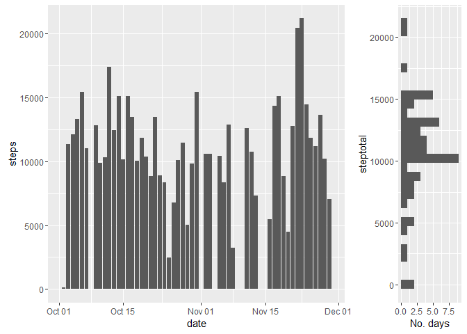
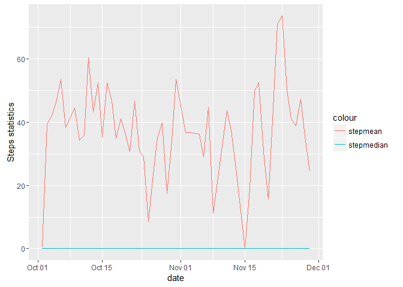
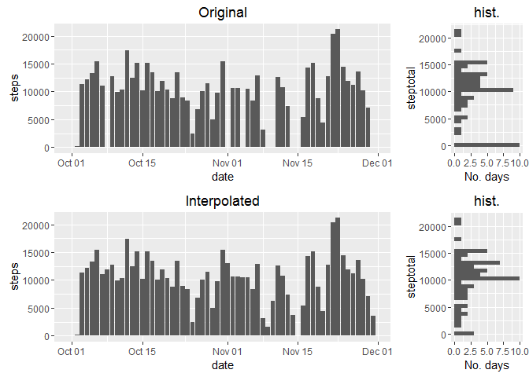
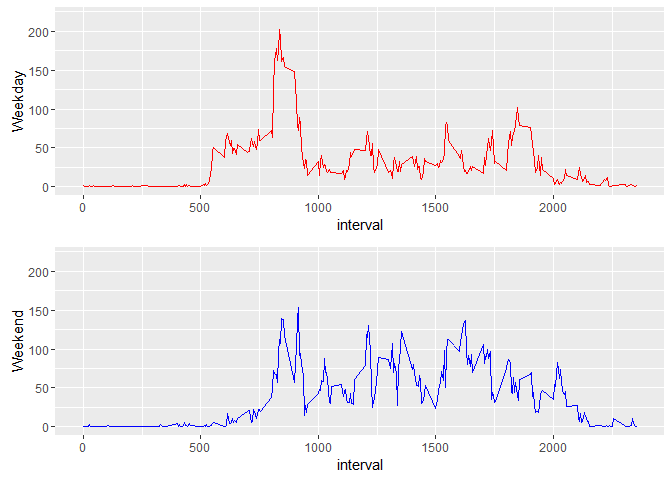

# Reproducible Research: Peer Assessment 1
Luis Peraza  

## Loading and preprocessing the data
###Loding R libraries

```r
  library(lubridate)
  library(plyr)
  library(ggplot2)
  library(gridExtra)
```

##Loading the dataset into R.
####1 Load files and make dates to date format with Lubridate

```r
mydata <- read.csv(unz("repdata_data_activity.zip", "activity.csv"), header = TRUE)
mydata$date <- ymd(mydata$date)
```

## What is mean total number of steps taken per day?
####2 Histogram of number of steps taken each day

First we estimate basic statistics, mean, median and total


```r
mydata2 <- mydata[complete.cases(mydata),]
mean_median <- ddply(mydata2, "date", summarize, stepmean = mean(steps), 
                     stepmedian = median(steps), steptotal = sum(steps))
```

Now we can create an informative plot with the histogram


```r
hist_right <- ggplot(mean_median) + geom_histogram(aes(steptotal)) + coord_flip() + ylab("No. days")
bar_center <- ggplot(mydata, aes(x=date, y=steps)) + geom_bar(stat = "identity")
grid.arrange(bar_center, hist_right, ncol=2, nrow=1, widths = c(3,1))
```

```
## Warning: Removed 2304 rows containing missing values (position_stack).
```

```
## `stat_bin()` using `bins = 30`. Pick better value with `binwidth`.
```



The warning indicates that 2304 rows in this dataset have NA values  


## What is the average daily activity pattern?
####3. Estimate mean and median of number of steps takes each day

This was done for the second question but it is repeated here:


```r
mydata2 <- mydata[complete.cases(mydata),]
mean_median <- ddply(mydata2, "date", summarize, stepmean = mean(steps), 
                     stepmedian = median(steps), steptotal = sum(steps))
```

I can estimate mean and median of steps for all days

mean: 

```r
    mean(mean_median$steptotal)
```

```
## [1] 10766.19
```

median:

```r
    median(mean_median$steptotal)
```

```
## [1] 10765
```


####4. Time series plot of the average number of steps and the median

```r
ggplot(mean_median, aes(date)) + 
  geom_line(aes(y = stepmean, colour = "stepmean")) + 
  geom_line(aes(y = stepmedian, colour = "stepmedian")) + ylab("Steps statistics")
```



The plot for the median shows that many of the 5 min intervals had 0 steps which means that in all days more the half the time this person is not walking.

####5. The 5-minute interval that, on average, contains the maximum number of steps

```r
indx <- which.max(mydata$steps)
mydata[indx,]
```

```
##       steps       date interval
## 16492   806 2012-11-27      615
```

I am not sure what the instructors meant for "on average". I am showing the interval that had the maximum number of steps and the day it happened.

## Imputing missing values
####6 Showing a strategy for imputing missing values

My strategy was to use the average of steps one day before and one day after for all NA values. The code is shown below:


```r
#View which dates have NA values
aux <- subset(mydata, is.na(steps))
mydata0 <- mydata #Make copies
mydata1 <- mydata
mydata0$date <- mydata0$date - days(1) #Add and substract one day
mydata1$date <- mydata1$date + days(1)
mydata3 = merge(mydata0, mydata1, by = c("date","interval"), all = TRUE) #Merge by day
mydata3 <- mydata3[with(mydata3, order(date, interval)),]
mydata3 <- subset(mydata3, date > ymd("2012-09-30") & date < ymd("2012-12-01")) #Delete the extra days
mydata3[is.na(mydata3)] <- 0
mydata3 <- mutate(mydata3, newsteps = (steps.x + steps.y)/2) #step averaging
interpdata <- mydata
interpdata[is.na(mydata$steps),1] <- mydata3[is.na(mydata$steps),5] # Got them!
rm(list = c("mydata0","mydata1","mydata3"))
```

###7. Histogram of number of steps after missing values

```r
interptotal <- ddply(interpdata, "date", summarize, steptotal = sum(steps))
interp_hist <- ggplot(interptotal) + geom_histogram(aes(steptotal)) + coord_flip() + ylab("No. days") + 
  ggtitle("hist.")
interp_bar  <- ggplot(interpdata, aes(x=date, y=steps)) + geom_bar(stat = "identity") + ggtitle("Interpolated")
mydata2 <- mydata
mydata2[is.na(mydata)]<-0
origtotal <- ddply(mydata2, "date", summarize, steptotal = sum(steps))
orig_hist <- ggplot(origtotal) + geom_histogram(aes(steptotal)) + coord_flip() + ylab("No. days") + 
  ggtitle("hist.")
orig_bar  <- ggplot(mydata2, aes(x=date, y=steps)) + geom_bar(stat = "identity") + ggtitle("Original")
grid.arrange(orig_bar, orig_hist, interp_bar, interp_hist,ncol=2, nrow=2, widths = c(3,1), heights = c(3,3))
```

```
## `stat_bin()` using `bins = 30`. Pick better value with `binwidth`.
## `stat_bin()` using `bins = 30`. Pick better value with `binwidth`.
```




In this case because I assumed the NAs as 0s, there were changes in the histogram for the zeros days. For the rest of the days and steps the histogram didn't change considerably.

## Are there differences in activity patterns between weekdays and weekends?
###8. Panel plot comparing the average number of steps taken per 5-minute interval across weekdays and weekends


```r
#Create day of the week factor variable
aux <- weekdays(mydata2$date)=="Sunday" | weekdays(mydata2$date)=="Saturday"
mydata2 <- mutate(mydata2, weekday=factor(aux, labels=c("weekday","weekend")))
#Subset in weekdays and weekends
weekdaydf <- subset(mydata2, weekday == "weekday")
weekenddf <- subset(mydata2, weekday == "weekend")
```

Ploting the results in two panels


```r
p1 <- ggplot(weekdaydf, aes(x=interval, y=steps)) + 
      stat_summary(fun.y = mean, geom = "line",colour = "red") + ylab("Weekday") +
      coord_cartesian(ylim = c(0, 220))
p2 <- ggplot(weekenddf, aes(x=interval, y=steps)) + 
      stat_summary(fun.y = mean, geom = "line",colour = "blue") + ylab("Weekend") +
      coord_cartesian(ylim = c(0, 220))
grid.arrange(p1,p2)
```


